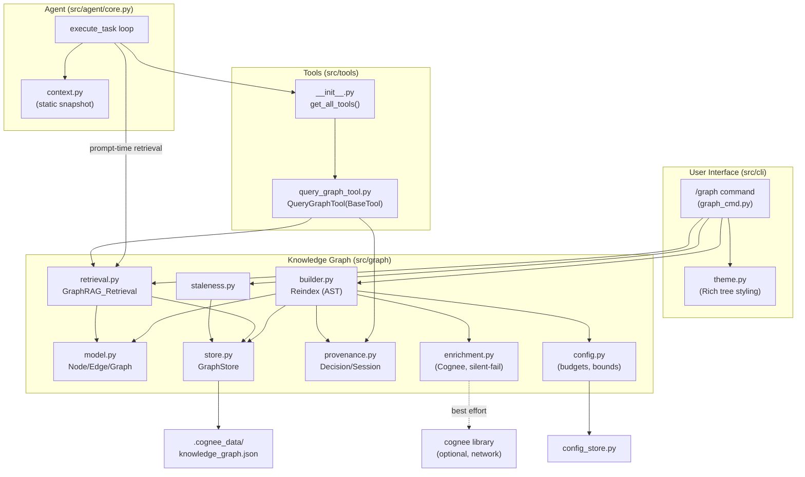
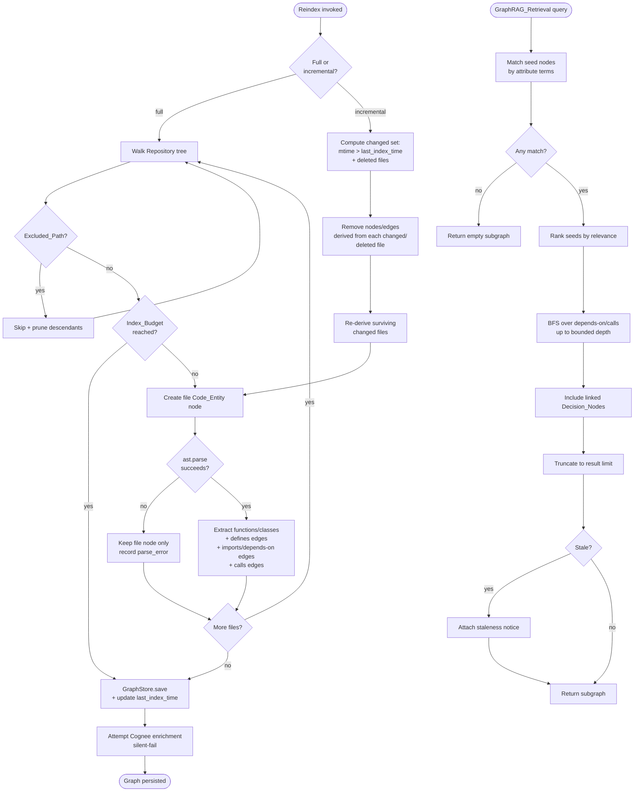

# Design Document: Codebase Knowledge Graph

## Overview

The Codebase Knowledge Graph is Omni-Dev's flagship differentiating feature: a persistent,
relationship-aware index of the repository that the agent consults *before* acting. Where
`src/context.py` injects a one-shot static snapshot (git status, a shallow directory tree, the
README), the Knowledge Graph adds a *queryable, incremental, relationship-aware* layer that follows
edges (imports, defines, calls, depends-on, relates-to) rather than matching keywords alone.

The design follows the resilience pattern already proven by `src/simple_memory.py`: a reliable,
dependency-free local store is the **always-works primary**, and optional Cognee enrichment is a
**best-effort secondary that fails silently** (mirroring `src/tools/memory_tools.py`). All core
behavior — build, persist, retrieve, query — is verifiable offline with pytest and requires no
network.

The feature is surfaced two ways:

1. **To the model** as an agent tool (`query_graph`, a `BaseTool` subclass) registered in the
   `src/tools/__init__.py` registry, so the model can ask the graph relationship questions
   mid-task through the normal tool path.
2. **To the user** as a `/graph` slash command (build / query / neighborhood subcommands) that
   renders results as a themed Rich tree using `src/cli/theme.py`.

In addition, the agent loop (`src/agent/core.py`) performs a GraphRAG retrieval for each user
prompt and injects the resulting subgraph as a new context key alongside the existing static
context, so the model starts every prompt already aware of the most relevant code relationships.

### Design Goals (mapped to requirements)

- **Relationship-aware indexing** of files, functions, and classes via Python's `ast` module,
  tolerant of unparseable files (Req 1).
- **Fast incremental reindex** keyed by file modification time, adding and removing derived nodes
  and edges precisely (Req 2).
- **Zero-cloud local persistence** with round-trip fidelity and corrupt/missing → empty fallback
  (Req 3).
- **GraphRAG retrieval** combining entity matching with bounded edge traversal, ranking, and a
  result limit (Req 4).
- **Agent tool** conforming to the `BaseTool` interface (Req 5).
- **`/graph` slash command** with themed Rich-tree rendering (Req 6).
- **Decision/Session provenance** linked via `relates-to` edges (Req 7).
- **Staleness detection** with result annotation (Req 8).
- **Performance & safety bounds**: no network, bounded indexing and traversal (Req 9).
- **Offline verifiability** with a pytest fixture repository (Req 10).

### Non-Goals

- Full semantic resolution of dynamic dispatch, runtime imports, or cross-language call graphs.
  Call/import edges are derived from static AST analysis with name-based matching, accepting that
  this is approximate.
- Replacing the static context snapshot; the graph *complements* it.
- Requiring Cognee or any network service for any core behavior.

## Architecture

### Module Layout

All new modules live under a new `src/graph/` package, plus one new tool module and one new
command handler. Existing modules are integrated with, not rewritten.

| Module | Responsibility | Requirements |
|---|---|---|
| `src/graph/model.py` | `Graph_Node`, `Graph_Edge`, `Knowledge_Graph` dataclasses; stable id derivation; (de)serialization helpers | 1, 3, 7 |
| `src/graph/store.py` | `GraphStore`: dependency-free local persistence under `.cognee_data/`; round-trip; corrupt/missing → empty fallback; last-index metadata | 3, 8 |
| `src/graph/builder.py` | `Reindex` (full + incremental): AST parsing of `.py`, pluggable lightweight handlers, `Excluded_Path` skipping, `Index_Budget` bounds, parse-failure tolerance, mtime-based incremental | 1, 2, 9 |
| `src/graph/retrieval.py` | `GraphRAG_Retrieval`: entity match + bounded edge traversal over `depends-on`/`calls`, ranking, result limit, subgraph assembly | 4, 7 |
| `src/graph/provenance.py` | `Decision_Node` / `Session_Node` capture + `relates-to` edges | 7 |
| `src/graph/staleness.py` | mtime-vs-last-index detection; changed-file set; staleness annotation helper | 8 |
| `src/graph/enrichment.py` | Optional, silent-fail Cognee enrichment (mirrors `memory_tools` pattern) | 3 |
| `src/graph/config.py` | Read `Index_Budget` bounds, traversal depth, result limit from `config_store` with safe defaults | 9 |
| `src/tools/query_graph_tool.py` | `QueryGraphTool(BaseTool)`; registered in `src/tools/__init__.py` | 5 |
| `src/commands/graph_cmd.py` | `/graph` handler: build / query / neighborhood subcommands; themed Rich-tree rendering | 6, 8 |

### Component Diagram



### Indexing and Retrieval Flow



### Resilience Strategy

The architecture layers reliability exactly like the memory subsystem:

- **Primary (always works, offline):** `GraphStore` reads/writes a single JSON document under
  `.cognee_data/`. Every read path is wrapped so a missing or corrupt file yields an empty
  `Knowledge_Graph` rather than an exception (mirrors `simple_memory._load_memories`).
- **Secondary (best effort, silent fail):** `enrichment.py` attempts to push graph content to
  Cognee inside a broad `try/except` that swallows all errors and import failures (mirrors
  `memory_tools.MemoryWriteTool.call`). Core operations never depend on its success.

## Components and Interfaces

The interfaces below are illustrative (pseudocode signatures and docstrings), not implementation.

### `src/graph/model.py`

```python
# Edge types are a closed set drawn from the glossary.
EDGE_TYPES = {"imports", "defines", "calls", "depends-on", "relates-to"}
NODE_TYPES = {"file", "module", "function", "class", "decision", "session"}

@dataclass(frozen=True)
class Graph_Node:
    id: str                 # stable id (see id derivation below)
    type: str               # one of NODE_TYPES
    attrs: dict             # path, name, line_start, line_end, summary, etc.

@dataclass(frozen=True)
class Graph_Edge:
    src: str                # source node id
    dst: str                # destination node id
    type: str               # one of EDGE_TYPES

@dataclass
class Knowledge_Graph:
    nodes: dict[str, Graph_Node]      # id -> node
    edges: set[Graph_Edge]            # de-duplicated set of directed edges

    def add_node(self, node) -> None: ...
    def add_edge(self, src, dst, type) -> None: ...
    def remove_nodes_for_file(self, path) -> None:
        """Remove the file node, its sub-entity nodes, and all incident edges."""
    def neighbors(self, node_id, edge_types=None, direction="out") -> list[Graph_Node]: ...
    def to_dict(self) -> dict: ...               # on-disk schema
    @classmethod
    def from_dict(cls, data) -> "Knowledge_Graph": ...

def node_id(node_type, path, name=None, line_start=None) -> str:
    """Derive a stable, deterministic id so re-deriving an unchanged entity
    yields an identical id (round-trip + incremental correctness)."""
    # e.g. "file::src/graph/store.py" or "function::src/graph/store.py::GraphStore.save#L42"
```

Stable id derivation is central: ids are pure functions of (type, normalized relative path, name,
line span). This guarantees that re-deriving an unchanged file reproduces identical ids (so
incremental reindex of an unchanged file is a no-op at the data level) and that persisted/loaded
graphs compare equal.

### `src/graph/store.py`

```python
class GraphStore:
    def __init__(self, project_root: Path | None = None):
        """Resolve .cognee_data/knowledge_graph.json using the same project-root
        walk as simple_memory._get_memory_path()."""

    def save(self, graph: Knowledge_Graph, last_index_time: float) -> bool:
        """Persist graph + metadata atomically (temp file + os.replace, like
        config_store._atomic_write). Returns True on success, never raises."""

    def load(self) -> tuple[Knowledge_Graph, GraphMeta]:
        """Return (graph, meta). On missing file -> (empty graph, meta with
        needs_reindex=True). On corrupt file -> (empty graph, ...) WITHOUT raising."""

    def exists(self) -> bool: ...
    def path(self) -> Path: ...
```

### `src/graph/builder.py`

```python
class Reindexer:
    def __init__(self, project_root, store, config, excluded_paths=DEFAULT_EXCLUDED): ...

    def full_reindex(self) -> ReindexResult:
        """Walk the repo, build all nodes/edges, enforce Index_Budget, persist,
        attempt enrichment. Persists even an empty partial graph."""

    def incremental_reindex(self) -> ReindexResult:
        """Identify files with mtime > last_index_time and deleted files; remove
        their derived nodes/edges; re-derive surviving changed files; update
        last_index_time; persist. No-op on data if nothing changed."""

    def _parse_python_file(self, path, source) -> FileParseResult:
        """ast.parse the source; extract top-level functions/classes, import
        statements, and call expressions. On SyntaxError/ValueError, return a
        result flagged parse_failed=True so the caller keeps a file-only node."""
```

`Excluded_Path` reuses the noise set from the requirements glossary, which is the same set already
used by `src/context.py:get_directory_structure` (`.git`, `node_modules`, `venv`, `.venv`,
`__pycache__`, `dist`, `build`, `.next`). The builder centralizes this set as
`DEFAULT_EXCLUDED` so both modules stay aligned.

Edge derivation rules:
- **defines**: file node → each top-level function/class node found by AST.
- **imports**: file node → imported module node (created on demand as a `module` node).
- **depends-on**: importing file node → depended-upon *file* node, when the imported module
  resolves to another indexed file in the repository.
- **calls**: calling code-entity → called code-entity, when a `Call` expression's name matches a
  known defined function/class id. Name-based matching is intentionally approximate (documented
  non-goal).

### `src/graph/retrieval.py`

```python
@dataclass
class RetrievalResult:
    nodes: list[Graph_Node]
    edges: list[Graph_Edge]      # each carries its relationship type
    stale: bool
    notice: str | None           # staleness / empty-graph notice

class GraphRAGRetriever:
    def __init__(self, graph, config, staleness): ...

    def retrieve(self, query: str) -> RetrievalResult:
        """1) tokenize query; match seed nodes by attr terms (name/path/summary).
        2) rank seeds by match score. 3) BFS expand over depends-on/calls up to
        config.max_depth. 4) include Decision_Nodes linked to matched entities.
        5) truncate ranked nodes to config.result_limit. 6) annotate staleness."""

    def dependents_of(self, entity_name: str) -> RetrievalResult:
        """Nodes connected to the named entity by INBOUND depends-on edges."""

    def definition_of(self, symbol: str) -> RetrievalResult:
        """The file node + line span where a symbol is defined."""
```

### `src/tools/query_graph_tool.py`

```python
class QueryGraphTool(BaseTool):
    @property
    def name(self): return "query_graph"
    @property
    def description(self): return "Query the codebase knowledge graph for code entities and their relationships (imports, calls, dependencies, definitions, and recorded decisions). Read-only."
    @property
    def parameters(self):
        return {"query": {"type": "string", "description": "Natural-language or relationship question about the codebase."}}
    @property
    def required_params(self): return ["query"]
    def is_read_only(self): return True
    def needs_permissions(self, input_args): return False

    async def call(self, query: str = "", **kwargs) -> str:
        """Validate query; load graph; if empty -> 'graph empty, run reindex'.
        Detect intent (dependents / definition / rationale / general), run the
        matching retrieval, and format a structured string result. Prepend a
        staleness notice when the graph is stale."""

    def to_schema(self): ...   # inherited from BaseTool
```

Registration: `QueryGraphTool` is imported in `src/tools/__init__.py`, added to `__all__`, and
appended to the list returned by `get_all_tools()`. Because `get_json_schemas()` derives from
`get_all_tools()`, the tool's schema is advertised to the model automatically.

### `src/commands/graph_cmd.py`

```python
async def graph_command(args: list[str], console) -> str:
    """Dispatch /graph subcommands:
      build                 -> full reindex; print node/edge counts
      query <text>          -> GraphRAG retrieval; render Rich tree (themed)
      neighborhood <name>   -> node + direct neighbors; render Rich tree
      (empty graph on query/neighborhood) -> instruct to run `build` first
      (unknown subcommand)  -> list supported subcommands
    Renders a staleness notice alongside query/neighborhood output when stale."""
```

The command builds a `rich.tree.Tree` styled with the existing theme styles (`app.accent`,
`app.muted`, `tool.read`, etc.) and prints via the shared themed `console`. The command name
`graph` is added to the `COMMANDS` registry in `src/commands/__init__.py` and to the interface's
`extras`/help listing in `src/cli/interface.py`.

### Agent Loop Integration (`src/agent/core.py`)

Two integration points, both additive:

1. **Tool exposure** — automatic once `QueryGraphTool` is in the registry; `OmniDevAgent.__init__`
   already builds `_tool_instances`/`_tool_schemas` from `get_all_tools()`/`get_json_schemas()`.

2. **Prompt-time GraphRAG retrieval** — in `execute_task`, after the static context is loaded and
   before the first model call, perform a retrieval for the user prompt and inject the resulting
   subgraph as a new context key (e.g. `codebaseGraph`) using the existing
   `format_system_prompt_with_context` machinery:

```python
# Illustrative addition inside execute_task, before the loop:
context = await self._load_context()
try:
    graph, meta = GraphStore().load()
    result = GraphRAGRetriever(graph, graph_config, staleness).retrieve(prompt)
    if result.nodes:
        context = {**context, "codebaseGraph": render_subgraph_text(result)}
except Exception:
    pass  # graph is best-effort context; never blocks the prompt
full_system = format_system_prompt_with_context(self.system_instruction, context)
```

This keeps the graph an *additive* context source: any failure leaves the existing static-context
behavior unchanged (Req 9.4).

## Data Models

### Graph_Node

| Field | Type | Description |
|---|---|---|
| `id` | str | Stable, deterministic id derived from type + path + name + line span |
| `type` | str | `file` \| `module` \| `function` \| `class` \| `decision` \| `session` |
| `attrs` | dict | Type-specific attributes (below) |

`attrs` by node type:
- **file**: `{path, language, parse_error?: bool}`
- **module**: `{name}` (an imported module reference, possibly external)
- **function** / **class**: `{path, name, line_start, line_end, summary?}`
- **decision**: `{rationale, created_at}`
- **session**: `{summary, created_at}`

### Graph_Edge

| Field | Type | Description |
|---|---|---|
| `src` | str | Source node id |
| `dst` | str | Destination node id |
| `type` | str | `imports` \| `defines` \| `calls` \| `depends-on` \| `relates-to` |

Edges are directed and de-duplicated (stored in a set keyed by `(src, dst, type)`).

### On-Disk Schema (`.cognee_data/knowledge_graph.json`)

```json
{
  "version": 1,
  "meta": {
    "last_index_time": 1719000000.0,
    "indexed_files": {
      "src/graph/store.py": 1718990000.0,
      "src/graph/model.py": 1718990500.0
    },
    "partial": false
  },
  "nodes": [
    {"id": "file::src/graph/store.py", "type": "file",
     "attrs": {"path": "src/graph/store.py", "language": "python"}},
    {"id": "class::src/graph/store.py::GraphStore#L10", "type": "class",
     "attrs": {"path": "src/graph/store.py", "name": "GraphStore",
               "line_start": 10, "line_end": 48}}
  ],
  "edges": [
    {"src": "file::src/graph/store.py",
     "dst": "class::src/graph/store.py::GraphStore#L10", "type": "defines"},
    {"src": "file::src/graph/store.py",
     "dst": "module::pathlib", "type": "imports"}
  ]
}
```

- `meta.indexed_files` maps each indexed source file's relative path to the mtime captured at index
  time. This is the basis for both incremental reindex (Req 2.1) and staleness detection (Req 8).
- `meta.partial` records whether indexing stopped early due to `Index_Budget` (Req 1.9).
- `version` allows forward-compatible schema evolution; an unrecognized/missing version is treated
  as corrupt → empty (Req 3.4).

### Decision_Node / Session_Node Shapes

```python
# Decision_Node
{"id": "decision::<hash>", "type": "decision",
 "attrs": {"rationale": "Chose JSON store for zero-dependency resilience",
           "created_at": "2025-01-15T12:00:00"}}
# relates-to edges: decision -> each affected Code_Entity id

# Session_Node
{"id": "session::<timestamp>", "type": "session",
 "attrs": {"summary": "Implemented incremental reindex", "created_at": "..."}}
# relates-to edges: session -> each touched Code_Entity id
```

### Last-Index Metadata (`GraphMeta`)

```python
@dataclass
class GraphMeta:
    last_index_time: float          # epoch seconds of last successful reindex
    indexed_files: dict[str, float] # rel path -> mtime at index time
    partial: bool                   # True if Index_Budget halted indexing
    needs_reindex: bool = False     # True when loaded from missing/corrupt store
```

### Configuration (`Index_Budget` and bounds)

Read via `src/graph/config.py` from `config_store` (project config preferred, then global, then
defaults), mirroring how `cost_tracker` reads thresholds defensively:

| Setting | Default | Requirement |
|---|---|---|
| `graphMaxFiles` (Index_Budget file max) | 5000 | 1.9, 9.2 |
| `graphMaxSeconds` (Index_Budget duration max) | 30.0 | 1.9, 9.2 |
| `graphMaxDepth` (traversal edge depth bound) | 2 | 4.2, 9.3 |
| `graphResultLimit` (retrieval node cap) | 25 | 4.4 |

Any missing/invalid value falls back to the default without raising.

## Correctness Properties

*A property is a characteristic or behavior that should hold true across all valid executions of a
system — essentially, a formal statement about what the system should do. Properties serve as the
bridge between human-readable specifications and machine-verifiable correctness guarantees.*

These properties were derived from the acceptance-criteria prework and consolidated to remove
redundancy (e.g., the depth bound in Req 9.3 is folded into the reachability property; the
file/duration budget in Req 1.9 and 9.2 is a single budget property; the Req 10 verification
criteria are satisfied by the build/persistence/retrieval properties rather than duplicated).

### Property 1: Build creates exactly one file node per indexable source file

*For any* repository tree, after a full Reindex the set of `file` Code_Entity nodes corresponds
one-to-one with the set of indexable source files outside every `Excluded_Path`.

**Validates: Requirements 1.1, 10.1**

### Property 2: Every function and class has a defining file and a defines edge

*For any* parseable source file, each top-level function and class in the file produces a
Code_Entity node, and there is a `defines` edge from that file's node to each such node (and no
function/class node exists without exactly one inbound `defines` edge from its containing file).

**Validates: Requirements 1.2, 1.3**

### Property 3: Imports produce imports and depends-on edges

*For any* source file containing import statements, there is an `imports` edge from the file node
to each imported module node, and a `depends-on` edge from the file node to the depended-upon file
node whenever the imported module resolves to another indexed file in the repository.

**Validates: Requirements 1.4, 1.6**

### Property 4: Calls to known defined entities produce calls edges

*For any* source file in which a code entity calls a function or class that is a known defined
Code_Entity, there is a `calls` edge from the calling Code_Entity node to the called Code_Entity
node.

**Validates: Requirements 1.5**

### Property 5: Excluded paths are fully excluded

*For any* repository containing files under an `Excluded_Path`, no Graph_Node and no Graph_Edge in
the resulting Knowledge_Graph derives from any path at or beneath that `Excluded_Path`.

**Validates: Requirements 1.7**

### Property 6: Unparseable files are tolerated

*For any* repository containing files that cannot be parsed, each unparseable file yields a single
`file` Code_Entity node with no sub-entity nodes, and every other (parseable) file in the same
repository is still fully indexed.

**Validates: Requirements 1.8**

### Property 7: Indexing respects the Index_Budget and always persists

*For any* repository and any `Index_Budget`, a full Reindex indexes no more files than the file
maximum, stops once the duration maximum is reached, and persists the resulting (possibly partial,
possibly empty) Knowledge_Graph.

**Validates: Requirements 1.9, 9.2**

### Property 8: Incremental reindex detects exactly the changed file set

*For any* previously indexed repository, an incremental Reindex identifies precisely the set of
source files whose modification time is later than the last index time, together with previously
indexed files that no longer exist.

**Validates: Requirements 2.1, 8.3**

### Property 9: Incremental reindex precisely re-derives changed files and drops deleted files

*For any* previously indexed repository, after an incremental Reindex the nodes and edges derived
from each changed file equal those produced by re-deriving that file from scratch (stale
sub-entities removed, new ones present), and no node or edge derived from a deleted file remains.

**Validates: Requirements 2.2, 2.3**

### Property 10: Incremental reindex with no changes is a no-op on graph data

*For any* previously indexed repository in which no source file changed since the last index time,
an incremental Reindex leaves the set of Graph_Nodes and Graph_Edges unchanged.

**Validates: Requirements 2.5**

### Property 11: Persistence round-trip preserves the graph

*For any* valid Knowledge_Graph, persisting it to the Graph_Store and then loading it yields a
Knowledge_Graph whose Graph_Nodes and Graph_Edges are equal to the original.

**Validates: Requirements 3.2, 10.2**

### Property 12: Missing or corrupt store loads as empty without error

*For any* Graph_Store file content that is missing or not a valid graph document, loading the
Graph_Store returns an empty Knowledge_Graph and reports that a Reindex is required, without
raising an error.

**Validates: Requirements 3.3, 3.4, 10.3**

### Property 13: Enrichment failure never blocks reindex

*For any* failure mode of Cognee_Enrichment (raised exception or unavailable library), a Reindex
still completes successfully and the local Knowledge_Graph remains intact and usable.

**Validates: Requirements 3.6**

### Property 14: Retrieval seeds match query terms

*For any* query string and any Knowledge_Graph, every Graph_Node in the initial selected (seed) set
shares at least one query term with one of its matchable attributes (name, path, or summary).

**Validates: Requirements 4.1**

### Property 15: Retrieved nodes are reachable from a seed within the depth bound

*For any* query and any Knowledge_Graph, every non-seed Graph_Node in the returned subgraph is
reachable from some seed node by traversing only `depends-on` and `calls` Graph_Edges within the
configured bounded edge depth.

**Validates: Requirements 4.2, 9.3, 10.4**

### Property 16: Returned subgraph is structurally valid

*For any* retrieval result, every returned Graph_Edge connects two Graph_Nodes that are both
present in the returned node set, and every returned edge carries a relationship type drawn from
the closed edge-type set.

**Validates: Requirements 4.3**

### Property 17: Retrieval never exceeds the result limit

*For any* query and any Knowledge_Graph, the number of Graph_Nodes returned by a GraphRAG_Retrieval
is at most the configured result limit, and the returned nodes are the highest-ranked candidates.

**Validates: Requirements 4.4**

### Property 18: Query_Graph_Tool conforms to the BaseTool interface

*For any* instance of the Query_Graph_Tool, it exposes a non-empty `name`, `description`, and
`parameters` schema, a `required_params` list, `is_read_only()` returns true, `needs_permissions()`
returns false, `call` is an async coroutine, and `to_schema()` produces a well-formed
function-schema dict.

**Validates: Requirements 5.1**

### Property 19: Tool query returns a structured description of matches

*For any* query that matches one or more Graph_Nodes, the Query_Graph_Tool `call` result is a
string that names each matched Graph_Node and describes its relationships.

**Validates: Requirements 5.2**

### Property 20: Tool answers dependents, definition, and rationale questions correctly

*For any* named Code_Entity, the Query_Graph_Tool returns: for a dependents question, exactly the
Graph_Nodes connected by inbound `depends-on` edges; for a definition question, the file node and
line span where the symbol is defined; and for a rationale question, the rationale text of every
Decision_Node linked to that entity.

**Validates: Requirements 5.3, 5.4, 7.5**

### Property 21: Provenance nodes are created and linked

*For any* recorded architectural decision, a Decision_Node is created carrying the rationale and a
creation timestamp, with a `relates-to` edge to each affected Code_Entity; and *for any* recorded
session summary, a Session_Node is created carrying the summary text and a creation timestamp.

**Validates: Requirements 7.1, 7.2, 7.3**

### Property 22: Linked decisions are included in retrieval

*For any* retrieval whose matched set includes a Code_Entity linked to a Decision_Node by a
`relates-to` edge, the returned subgraph includes that Decision_Node.

**Validates: Requirements 7.4**

### Property 23: Results are annotated when the graph is stale

*For any* GraphRAG_Retrieval or Query_Graph_Tool result produced while Staleness is present, the
result is annotated with a notice that the Knowledge_Graph is stale.

**Validates: Requirements 8.1**

### Property 24: Incremental reindex clears staleness

*For any* stale Knowledge_Graph, a successful incremental Reindex clears the Staleness condition so
that a subsequent staleness check reports the graph as current.

**Validates: Requirements 8.4**

### Property 25: All core operations make no network requests

*For any* core Knowledge_Graph operation (Reindex, persistence, GraphRAG_Retrieval, Query_Graph_Tool
call), the operation completes without attempting any network connection.

**Validates: Requirements 9.1**

## Error Handling

All error handling follows the project's established resilience posture: the local store is the
always-works primary, optional enrichment fails silently, and no graph operation may raise an
unhandled exception into the agent loop or the REPL (Req 9.4).

| Condition | Behavior | Requirement |
|---|---|---|
| Store file missing on load | Return empty `Knowledge_Graph`; set `meta.needs_reindex=True`; surface "reindex required" | 3.3 |
| Store file present but corrupt/unparseable | Discard content; return empty `Knowledge_Graph`; do not raise; do not delete file | 3.4 |
| Source file raises `SyntaxError`/`ValueError` during parse | Keep a file-only node with `parse_error=True`; continue indexing remaining files | 1.8 |
| `Index_Budget` file maximum reached | Stop scanning; persist partial graph; set `meta.partial=True` | 1.9, 9.2 |
| `Index_Budget` duration maximum reached | Stop scanning; persist partial graph; set `meta.partial=True` | 1.9, 9.2 |
| Partial graph contains no nodes | Persist the empty graph normally | 1.9 |
| Cognee unavailable (import fails) | Skip enrichment silently; complete operation successfully | 3.6 |
| Cognee enrichment raises any error | Swallow exception; continue with local graph; complete successfully | 3.6 |
| Store write fails (I/O error) | Return failure status from `save()`; never raise; session continues | 9.4 |
| Empty/missing query to `query_graph` tool | Return error string indicating a query is required | 5.5 |
| Query against empty graph (tool) | Return message: graph empty, run a Reindex | 5.6 |
| `/graph query`/`neighborhood` on empty graph | Display message instructing user to run `/graph build` first | 6.4 |
| `/graph` unrecognized subcommand | Display the list of supported subcommands | 6.5 |
| No node matches a retrieval query | Return an empty subgraph (not an error) | 4.5 |
| Any internal graph operation fails | Report the failure to the caller; allow the current session to continue | 9.4 |
| Prompt-time retrieval fails in agent loop | Skip graph context injection; fall back to static context unchanged | 9.4, 4.6 |

## Testing Strategy

### Approach

Testing is dual: **property-based tests** verify the universal properties above across many
generated inputs, and **example/integration tests** cover specific UI rendering, command dispatch,
and wiring. All tests run **offline** with pytest — no network and no Cognee dependency (Req 10.5).

### Property-Based Testing

- **Library:** Hypothesis (the standard Python PBT library; already pytest-native). Do not
  implement property testing from scratch.
- **Iterations:** Each property test runs a minimum of 100 generated examples
  (`@settings(max_examples=100)` or higher).
- **Tagging:** Each property test carries a comment referencing its design property in the form:
  `# Feature: codebase-knowledge-graph, Property {number}: {property_text}`.
- **One test per property:** Each of Properties 1–25 is implemented by a single property-based
  test.

**Generators (Hypothesis strategies):**
- A *repository strategy* that builds a temporary directory of small `.py` files with controllable
  contents: known import sets, known top-level function/class definitions, and known intra-repo
  calls. It can inject (a) files under `Excluded_Path` directories, (b) syntactically broken files,
  and (c) arbitrary file counts to exercise the `Index_Budget`.
- A *graph strategy* that builds arbitrary valid `Knowledge_Graph` objects (random nodes of each
  type, random valid edges over the closed edge-type set) for the persistence round-trip and
  retrieval/structural properties.
- A *corrupt-bytes strategy* (arbitrary `binary()` / malformed JSON / wrong-shaped JSON) for the
  corrupt-store fallback property.
- A *query strategy* deriving query terms from known node attributes so matches are predictable,
  plus disjoint terms for the no-match edge case.

### Fixture Repository

A pytest fixture materializes a temporary repo of small `.py` files with **known** imports,
definitions, and calls (e.g., `pkg/a.py` defines `foo` and imports `pkg.b`; `pkg/b.py` defines
`Bar` and calls `foo`). This anchors the build property (Property 1–4), the retrieval reachability
property (Property 15), and the Req 10.1/10.4 verification criteria with deterministic expected
node/edge sets. The fixture also includes a `.git/` and `__pycache__/` directory to exercise
`Excluded_Path` handling (Property 5), and a deliberately broken file to exercise parse tolerance
(Property 6).

### Unit / Example / Integration Tests

Focused, low-count tests (not property tests) for behavior that does not vary meaningfully with
input:
- **Enrichment attempt (Req 3.5):** mock the enrichment hook; assert it is invoked once after a
  successful reindex.
- **Prompt-time context injection (Req 4.6):** build a graph, run the prompt-prep path, assert the
  `codebaseGraph` context key is present when matches exist and absent on failure.
- **Tool input validation (Req 5.5, 5.6):** call the tool with empty query and against an empty
  graph; assert the respective messages.
- **`/graph` command (Req 6.1, 6.2, 6.3, 6.5):** invoke each subcommand against the fixture repo;
  assert build prints correct counts, query/neighborhood produce a `rich.tree.Tree` with expected
  labels using theme styles, and an unknown subcommand lists supported subcommands.
- **Staleness display (Req 8.2):** stale graph; assert the rendered command output includes the
  staleness notice.
- **Empty-graph command guidance (Req 6.4):** assert the "run build first" message.
- **Resilience (Req 9.4):** inject store/retrieval failures; assert callers return a message and do
  not raise.

### No-Network Enforcement

A shared fixture monkeypatches `socket.socket.connect` (and the higher-level HTTP client entry
points) to raise on use, then exercises build, persist, retrieve, and tool calls. This both backs
Property 25 and guarantees the offline guarantee of Req 9.1/10.5 holds for the whole suite.

### Why Some Criteria Are Not Property Tests

- UI rendering (Req 6.2, 6.3, 8.2) is verified with example/snapshot-style assertions, since
  rendered tree appearance does not benefit from input randomization.
- Command dispatch and counts (Req 6.1, 6.5) and the enrichment attempt (Req 3.5) are example tests
  — their behavior is deterministic and does not vary meaningfully with input.
- Offline suite execution (Req 10.5) is a smoke/configuration guarantee enforced by the
  no-network fixture and the absence of cognee imports in the core path.

## Requirements Traceability

| Requirement | Design Elements | Properties / Tests |
|---|---|---|
| **1. Construction & Indexing** | `builder.py` (`full_reindex`, `_parse_python_file`, `DEFAULT_EXCLUDED`), `model.py` (node/edge derivation, stable ids) | Properties 1–7; fixture build test |
| **2. Incremental Re-Indexing** | `builder.py` (`incremental_reindex`), `store.py` (`meta.indexed_files`) | Properties 8, 9, 10 |
| **3. Local Persistence & Resilience** | `store.py` (atomic save, fallback load), `enrichment.py` (silent-fail Cognee) | Properties 11, 12, 13; enrichment example test |
| **4. GraphRAG Retrieval** | `retrieval.py` (`retrieve`, seed match, BFS depth bound, ranking, limit), agent-loop prompt-time injection | Properties 14–17, 22; Req 4.5/4.6 example tests |
| **5. Query Graph Agent Tool** | `tools/query_graph_tool.py` (`QueryGraphTool`), registry wiring in `tools/__init__.py` | Properties 18, 19, 20; Req 5.5/5.6 example tests |
| **6. Graph Slash Command** | `commands/graph_cmd.py`, `cli/theme.py` Rich-tree styling, registry in `commands/__init__.py` + `interface.py` | Req 6.1–6.5 example tests; Property 23 (notice) |
| **7. Decision & Session Provenance** | `provenance.py` (`record_decision`, `record_session`, `relates-to` edges), retrieval inclusion | Properties 20, 21, 22 |
| **8. Staleness Detection** | `staleness.py` (mtime vs `last_index_time`, changed-file set, annotation), command + tool notices | Properties 8, 23, 24; Req 8.2 example test |
| **9. Performance & Safety Bounds** | `config.py` (budgets/depth/limit), no-network design, broad try/except resilience | Properties 7, 15, 17, 25; Req 9.4 resilience test |
| **10. Offline Verifiability** | pytest fixture repo, Hypothesis generators, no-network fixture, no cognee in core path | Properties 1, 11, 12, 15; offline smoke (Req 10.5) |
