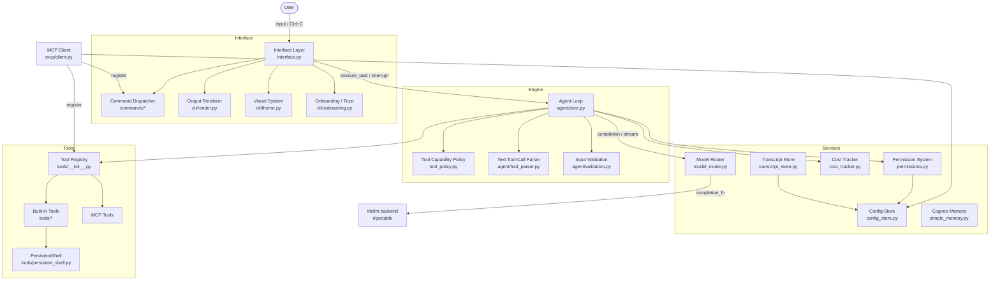
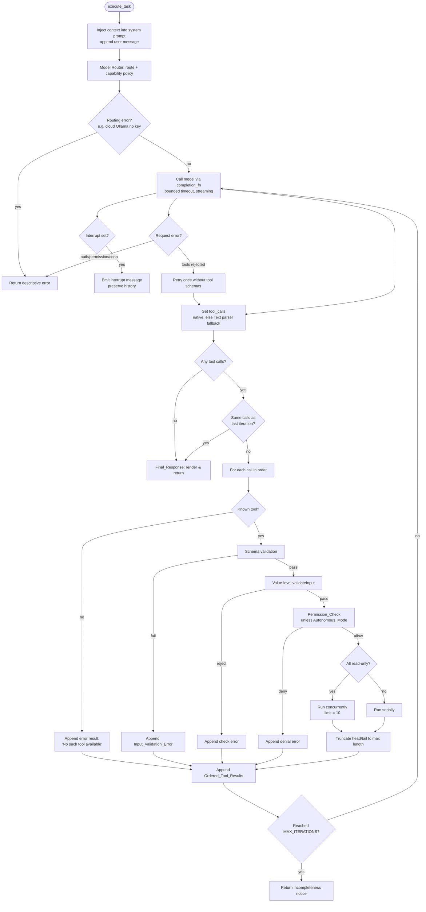

# Design Document

## Overview

Omni-Dev is a Python interactive CLI coding agent that drives an agentic tool-use loop over `litellm`, with `cognee`-backed graph memory and a Rich + `prompt_toolkit` terminal UI. This design addresses three reported defects — unreliable Ollama operation, an unprofessional interface, and incomplete agentic behavior — and expands scope to port the remaining portable functionality of the TypeScript reference (`scratch_repo`): persistent configuration, granular persistent permissions, a stateful shell, conversation persistence, MCP support, structured diffs, cost/token warnings, and additional utility commands plus first-run onboarding.

The core architectural strategy is **consolidation and clean separation**. Today the codebase has the same logic implemented two or three times (model normalization in both `interface.py` and `core.py`), defensive band-aids stacked on top of a fragile parser (`_clean_final_text` cleaning up after a hand-rolled balanced-brace JSON scanner), and a UI that fakes streaming by replaying a finished response word-by-word with `time.sleep`. The redesign replaces these with:

- A single **Model Router** module (`src/model_router.py`) that is the authoritative source for normalizing any model identifier into canonical `provider/model` form and selecting provider routing (local vs. cloud Ollama, `ollama_chat/` prefix for tool-capable Ollama, API base, timeouts, keys). Both the interface and agent engine call it.
- A **Tool Capability Policy** module that decides per-model whether to send native tool schemas, using an explicit allow/deny table plus heuristics — no longer blanket-disabling tools for all local Ollama models.
- A redesigned **Agent Loop** (`src/agent/core.py`) that mirrors the reference `query.ts`: schema validation before execution, value-level checks, unknown-tool handling, bounded-concurrency for read-only tools vs. serial for mutating tools, ordered tool results, permission gating with autonomous bypass, interrupt/cancellation via `asyncio`, and head/tail result truncation. A small, well-tested **Text Tool-Call Parser** becomes a clean fallback path used only for models without native tool calling.
- An **Output Renderer / Streaming Pipeline** that performs real token streaming from `litellm` into a Rich `Live` view, renders markdown/code fences correctly, never leaks literal `\n` or raw tool-call JSON, and renders structured diffs for edits.
- A **persistence layer**: a config store (global + per-project JSON), a transcript store (conversation save/resume/fork), and command history.
- A **permission system** ported from `permissions.ts`: per-tool `needs_permissions`, bash command-prefix permissions, `SAFE_COMMANDS`, command-injection detection, persistent `allowedTools`, and session-only write grants.
- A **PersistentShell** backing `run_command`, preserving cwd and environment across calls.
- An **MCP client** that registers discovered tools/commands into the registries.
- A cohesive **visual system** (Rich `Theme`, message framing, status footer, glyphs) inspired by Claude Code, Hermes, and OpenClaw.

All new logic is designed to be testable offline: model calls flow through a single injection point so tests can substitute a fake completion function, satisfying Requirement 8's no-network constraint.

### Research Notes

Key findings from reviewing `litellm` behavior and the reference implementation that inform this design:

- **`litellm` Ollama providers**: `litellm` exposes two Ollama providers — `ollama/` (legacy `/api/generate`-style, weak/no function-calling passthrough) and `ollama_chat/` (the `/api/chat` endpoint, which supports the `tools` parameter for models that advertise tool support). Routing tool-enabled Ollama requests through `ollama_chat/` is the documented way to get native tool calls from local models like `llama3.1`, `qwen2.5`, and `mistral-nemo`. This directly addresses Requirement 2.3.
- **Cloud vs. local Ollama**: local is served at `http://localhost:11434`; the hosted API is `https://ollama.com` and requires an API key passed as `api_key`. `litellm` selects the endpoint from `api_base`. (Requirements 1.3, 1.4, 1.5.)
- **`litellm` streaming**: `litellm.completion(..., stream=True)` yields chunk objects whose `choices[0].delta.content` carries incremental text and `choices[0].delta.tool_calls` carries incremental tool-call fragments. Streaming and tool-calling can be combined; tool-call fragments must be accumulated by index. This is what enables true token streaming (Requirement 4.3) while still detecting tool calls.
- **Reference loop semantics** (`query.ts`): `MAX_TOOL_USE_CONCURRENCY = 10`; tools run concurrently only when *every* requested tool is read-only; results are re-sorted to match tool-call order; permission/validation happen in `checkPermissionsAndCallTool` (zod `safeParse` → `normalizeToolInput` → `validateInput` → `canUseTool` → call). Error output is truncated head/tail at 10,000 chars. These are mirrored directly (Requirement 7).
- **Reference config** (`config.ts`): a single global JSON file holds `projects: Record<absolutePath, ProjectConfig>`; `ProjectConfig` carries `allowedTools`, `history`, `hasTrustDialogAccepted`, MCP server approval lists. Missing/corrupt files fall back to defaults without throwing or deleting. (Requirement 9.)
- **Reference permissions** (`permissions.ts`): `SAFE_COMMANDS` allowlist; bash permission keys of form `run_command(<prefix>:*)`; command-injection (`;`, `&&`, `|`, `$(...)`) forces exact-match approval; file-edit tools grant session-only write permission rather than persisting. (Requirement 10.)

## Architecture

The application is organized into four layers: **Interface**, **Engine**, **Services**, and **Tools**. The Interface owns all terminal I/O and slash commands. The Engine owns the agentic loop. Services are stateless-or-singleton support modules shared by both. Tools are the agent's capabilities.



### Module Responsibilities

| Module | Responsibility | Requirements |
|---|---|---|
| `model_router.py` | Single authoritative model-name normalization + provider/endpoint/key/timeout selection (local vs cloud Ollama, `ollama_chat/` prefix). Exposes the injectable `completion_fn`. | 1, 2.3, 5 |
| `tool_policy.py` | Decide per model whether to send native tool schemas (allow/deny table + heuristics). | 2 |
| `agent/core.py` | The agentic loop: request, validate, gate, execute (concurrent/serial), order results, truncate, interrupt, iterate. | 2, 6, 7 |
| `agent/tool_parser.py` | Clean fallback parser for Text_Tool_Calls (models without native tool calling). | 3.5, 7 |
| `agent/validation.py` | JSON-schema validation + per-tool value checks of model-generated args. | 7.1–7.3 |
| `cli/render.py` | Streaming + non-streaming renderer; markdown/code-fence handling; escape-sequence normalization; structured diffs; error rendering. | 3, 4, 6.6, 14 |
| `cli/theme.py` | Rich `Theme`, glyphs, message framing, banner, status footer. | 4 |
| `cli/onboarding.py` | First-run trust prompt; persists Project_Trust. | 16.7, 16.8 |
| `config_store.py` | Global + per-project JSON config with defaults, safe fallback, merge of missing keys. | 9 |
| `permissions.py` | Granular permission decisions; bash prefix permissions; injection detection; persistence; session write grants. | 10 |
| `transcript_store.py` | Save/list/resume/fork conversation transcripts; command history. | 12 |
| `mcp/client.py` | Connect to configured MCP servers; register tools + commands; graceful failure; approval persistence. | 13 |
| `cost_tracker.py` | Cumulative cost/token tracking + threshold warnings. | 15 |
| `tools/persistent_shell.py` | Stateful shell preserving cwd/env across `run_command` calls. | 11 |
| `commands/*` | Slash commands incl. bug, pr_comments, release-notes, terminalSetup, clear, resume, help. | 16 |

## Components and Interfaces

### Model Router (`src/model_router.py`)

The single authoritative normalization + routing component. Replaces the duplicated blocks currently in `interface.py` (the `/model` handler) and `core.py` (`execute_task`). Both layers call `normalize_model()` so they always agree (Requirement 5.2).

```python
@dataclass(frozen=True)
class RouteDecision:
    canonical_model: str        # e.g. "ollama_chat/llama3.1", "groq/llama-3.3-70b-versatile"
    provider: str               # "ollama", "groq", "openai", ...
    is_ollama: bool
    is_cloud_ollama: bool
    api_base: str | None        # localhost:11434 (local) or https://ollama.com (cloud)
    api_key: str | None         # resolved from env for the provider
    timeout: float              # bounded request timeout (default 120s)
    error: str | None = None    # set when routing is impossible (e.g. cloud Ollama w/o key)

def normalize_model(raw: str) -> str: ...
    # Strip quotes/whitespace, collapse '//', drop 'model '/'models/' prefixes,
    # map bare names to a provider prefix via inference, preserve Ollama size tags
    # for local addressing and cloud markers for cloud routing. (Req 5.1, 5.3-5.6)

def route(raw: str, env: Mapping[str,str]) -> RouteDecision: ...
    # Build a full RouteDecision. For tool-capable Ollama, use the 'ollama_chat/' prefix.
    # Set api_base/api_key for local vs cloud. Return error (no request) when a cloud
    # Ollama model has no API key. (Req 1.3-1.5, 2.3)

def get_completion_fn() -> CompletionFn: ...
    # Returns the callable used to talk to the model. Defaults to litellm.completion.
    # Tests inject a fake here so no network is used. (Req 8.8)
```

Normalization rules (consolidated from existing logic, deduplicated):

1. Trim surrounding whitespace and matching quotes; collapse repeated `/` (Req 5.4).
2. Strip leading `model ` / `models/`; map `ollama ` → `ollama/` (Req 5.4).
3. If no known provider prefix, infer: contains `/` → `openrouter/`; `gpt|o1|o3` → `openai/`; `claude` → `anthropic/`; `gemini` → `gemini/`; `llama|mixtral|gemma|oss|whisper` → `groq/`; `glm|qwen|deepseek|phi|yi` → `openrouter/` (Req 5.3).
4. Ollama: detect cloud via `cloud`/`-cloud`/`:cloud` marker or `ollama.com` api_base. Local models keep identity needed to address them; the size tag is preserved as-is when addressing local Ollama (Req 5.5, 5.6).
5. When the policy enables tools for an Ollama model, the route uses the `ollama_chat/` provider prefix (Req 2.3).
6. If normalization raises, each layer falls back to its own local resolution (Req 5.7).

Connectivity (Req 1.6): before a local Ollama request, the router probes `http://localhost:11434`. On failure it attempts `ollama serve` once, re-probes, and if still unreachable returns a descriptive connectivity error naming the model and remediation. A bounded `timeout` is always applied; a timeout terminates the pending request and yields a descriptive timeout error naming the model (Req 1.1, 1.2).

### Tool Capability Policy (`src/tool_policy.py`)

```python
# Explicit deny list: substrings of models known to LACK function calling.
NO_TOOL_MODELS = {"gemma:2b", "gemma:7b", "orca-mini", "phi:2", "tinyllama", ...}
# Explicit allow list: modern tool-capable models (override heuristics).
TOOL_CAPABLE = {"llama3.1", "llama3.2", "llama3.3", "qwen2.5", "mistral-nemo",
                "mistral-large", "command-r", "firefunction", ...}

def supports_tools(route: RouteDecision) -> bool: ...
    # 1. Cloud providers (groq/openai/anthropic/gemini/cloud-ollama): True unless in deny list.
    # 2. Local Ollama: True if model matches TOOL_CAPABLE allow list or its family is known
    #    tool-capable; False if in NO_TOOL_MODELS. (Req 2.1, 2.2)
    # 3. Unknown local models: optimistic True, relying on the loop's fallback-without-tools.
```

This replaces `disable_tools_for_model`, which blanket-disabled tools for all local Ollama. If a request that includes tool schemas is rejected, the loop retries once without schemas (Req 2.4) and surfaces a clear "tools unsupported" note.

### Agent Loop (`src/agent/core.py`)

`OmniDevAgent.execute_task(prompt, progress_callback, abort_event)` is rebuilt to mirror `query.ts`. The diagram below shows one iteration.



Key interface points:

```python
async def execute_task(self, prompt, progress_callback=None, abort_event=None) -> str: ...

# Read-only vs mutating split drives concurrency (Req 7.5, 7.6)
def _partition(self, calls) -> tuple[bool, list]: ...   # all_read_only?, calls
MAX_TOOL_USE_CONCURRENCY = 10
MAX_ITERATIONS = 40
MAX_TOOL_RESULT_CHARS = 10_000   # head/tail truncation (Req 7.13)
```

Concurrency uses `asyncio.Semaphore(10)` with `asyncio.gather`; results are collected with their call index and re-sorted to tool-call order before appending (Req 7.7). Interrupt is an `asyncio.Event` set by the UI on Ctrl+C; it is checked before each model call and before/within each tool round; when set, the loop stops and appends a benign assistant message so history stays consistent and a new request can follow (Req 7.11, 7.12).

### Text Tool-Call Parser (`src/agent/tool_parser.py`)

A small, isolated, unit-tested module replacing the inline balanced-brace scanner and `repair_json_string`. Used **only** when `supports_tools(route)` is False or the native response carried no `tool_calls` but content contains explicit tool-call markers.

```python
def extract_tool_calls(content: str, valid_tools: set[str]) -> list[ParsedCall]: ...
    # Locate fenced ```json/```tool blocks and explicit {"name","arguments"} objects.
    # Return only calls whose name is in valid_tools. Robust to no-match (returns []).

def strip_tool_call_text(content: str) -> str: ...
    # Remove recognized tool-call blocks from content so the Final_Response shows
    # only human-readable text. Replaces _clean_final_text. (Req 3.5, 3.1)
```

Because parsing is isolated and pure, it is directly property-testable, and `_clean_final_text` (the band-aid) is removed.

### Output Renderer (`src/cli/render.py`)

```python
async def stream_response(stream, console, theme) -> str: ...
    # Consume litellm streaming chunks; accumulate delta.content; update a Rich Live
    # Markdown view as tokens arrive (no per-word sleep). Accumulate delta.tool_calls
    # by index and return them for the loop. Returns the final assistant text. (Req 4.3, 4.5)

def render_final(text: str, console, theme) -> None: ...
    # Non-streaming fallback: single Markdown render, no artificial delay. (Req 4.4)

def normalize_escapes(text: str) -> str: ...
    # Convert literal '\n','\t' to real characters outside fenced code; preserve fences. (Req 3.2, 3.3)

def render_diff(old: str, new: str, path: str, console, theme) -> None: ...
    # Hunk-based colorized diff with context lines; new files render all-added. (Req 14)
```

The renderer guarantees the streamed result equals the non-streamed render of the same content (Req 4.5) by buffering raw text and rendering markdown from the full accumulated buffer on each Live update, rather than rendering token fragments independently.

### Permission System (`src/permissions.py`)

Rebuilt to port `permissions.ts`. The all-or-nothing `check_tool_permission` is replaced with the reference's granular model.

```python
SAFE_COMMANDS = {"git status","git diff","git log","git branch","pwd","tree","date","which"}

def get_command_prefix(command: str) -> CommandPrefix | None: ...
    # Returns prefix + injection flag. Injection if ';','&&','||','|','$(','`' present
    # in a way that prevents safe prefix verification. (Req 10.5)

def get_permission_key(tool_name: str, input_args: dict, prefix: str | None) -> str: ...
    # run_command -> "run_command(<prefix>:*)" or exact "run_command(<command>)"; else tool_name.

async def has_permission(tool, input_args, ctx) -> PermissionResult: ...
    # Autonomous bypass (10.8); blanket run_command in allowedTools (10.10);
    # SAFE_COMMANDS (10.2); prefix match (10.4); injection -> exact-match only (10.5);
    # file-edit tools -> session write grant (10.7); else allowedTools lookup or prompt (10.1).

def save_permission(tool, input_args, prefix, project_config) -> None: ...
    # Persist key to project allowedTools, except file-edit tools (session-only). (10.3, 10.6, 10.7)
```

The UI supplies an interactive approve/deny/remember callback (`canUseTool`) injected into the loop; denial returns an error result that the loop appends and continues (Req 10.9, 7.9).

### Config Store (`src/config_store.py`)

```python
GLOBAL_DIR = Path(os.environ.get("USERPROFILE", "~")).expanduser() / ".omni-dev"
GLOBAL_FILE = GLOBAL_DIR / "config.json"   # holds { projects: { <abspath>: ProjectConfig }, ... }

def get_global_config() -> GlobalConfig: ...
def save_global_config(cfg: GlobalConfig) -> None: ...
def get_project_config(path: str | None = None) -> ProjectConfig: ...   # keyed by abspath
def save_project_config(cfg: ProjectConfig, path: str | None = None) -> None: ...
```

Loading a missing file returns defaults; an unparseable file returns defaults without raising and without deleting it (Req 9.4, 9.5); present keys are preserved while missing keys receive defaults via a shallow merge (Req 9.6). Writes are atomic (temp file + replace).

### Transcript Store (`src/transcript_store.py`)

```python
TRANSCRIPT_DIR = GLOBAL_DIR / "transcripts"
def save_transcript(t: Transcript) -> str: ...      # returns id
def list_transcripts() -> list[TranscriptMeta]: ...
def load_transcript(id: str) -> Transcript: ...
def fork_transcript(id: str, upto_index: int) -> Transcript: ...  # new id, original untouched
```

Command history lives in `ProjectConfig.history` (max 100, most-recent-first, no consecutive duplicate) (Req 12.6–12.8).

### PersistentShell (`src/tools/persistent_shell.py`)

A session-scoped singleton backing `run_command`. On Windows it spawns a long-lived `powershell.exe` (fallback `cmd.exe`); on POSIX a `bash`. State (cwd, env) persists because the same process handles successive commands. Each command is wrapped with a unique sentinel marker so the shell knows where output ends and can capture the exit code.

```python
class PersistentShell:
    def run(self, command: str, timeout: float = 120) -> ShellResult: ...  # stdout, stderr, code, cwd
    def interrupt(self) -> None: ...   # terminate current command, keep shell alive
    def kill(self) -> None: ...
# ShellResult: stdout, stderr, exit_code, timed_out: bool
```

Timeout terminates the running command but keeps the shell usable; interrupt does the same (Req 11.5, 11.6). cwd/env changes carry to subsequent commands (Req 11.2, 11.3).

### MCP Client (`src/mcp/client.py`)

```python
async def connect_all(config) -> list[MCPConnection]: ...   # graceful per-server failure (Req 13.4)
def register_tools(conn, registry) -> None: ...             # wrap as MCPTool (Req 13.2, 13.5)
def register_commands(conn, command_registry) -> None: ...  # (Req 13.3)
```

`MCPTool` adapts an MCP tool to `BaseTool` so it flows through the same validation/permission/ordering path (Req 13.5). Server approval is persisted in config (Req 13.6).

### Command Dispatcher (`src/commands/*`)

New/ported commands: `bug` (capture + store locally), `pr_comments` (via `gh`/`git`, graceful error), `release-notes` (show changelog), `terminalSetup` (configure keybindings, persist to global config), `clear` (reset conversation history), `resume` (list/resume/fork transcripts). `help` enumerates all built-in, ported, and MCP-registered commands (Req 16).

## Data Models

### Global Config

Stored at `%USERPROFILE%/.omni-dev/config.json` (expanded cross-platform). The `projects` map keys each Project_Config by absolute path, mirroring the reference single-file model.

```jsonc
{
  "activeModel": "groq/openai/gpt-oss-120b",
  "numStartups": 0,
  "verbose": false,
  "theme": "omni-dark",
  "costThreshold": 5.0,            // USD; triggers Cost warning (Req 15.2)
  "tokenWarningThreshold": 1000000,// triggers Token warning (Req 15.3)
  "costThresholdAcknowledged": false, // (Req 15.4)
  "ollamaApiBase": null,           // optional explicit local base (Req 1.3)
  "terminalSetup": null,           // result of terminalSetup command (Req 16.5)
  "mcpServers": {                  // global MCP servers (Req 13.1)
    "<name>": { "type": "stdio", "command": "...", "args": ["..."], "approved": false }
  },
  "projects": { "<absolutePath>": { /* ProjectConfig */ } }
}
```

### Project Config

```jsonc
{
  "activeModel": null,             // per-project override of active model (Req 9.7, 9.8)
  "allowedTools": [                // persisted permission keys (Req 9.7, 10)
    "run_command(git commit:*)",
    "search_web"
  ],
  "history": ["latest input", "older input"],   // max 100, most-recent-first (Req 12.6-12.8)
  "hasTrustDialogAccepted": false, // Project_Trust (Req 16.7, 16.8)
  "mcpServers": { "<name>": { /* ... */ "approved": false } },  // (Req 13.1, 13.6)
  "context": {}
}
```

Defaults (`Config_Defaults`) are applied for any missing file, unparseable file, or missing key (Req 9.4–9.6).

### Permission Keys

| Scenario | Key form | Example |
|---|---|---|
| Non-bash tool blanket grant | `<tool_name>` | `search_web` |
| Bash blanket grant | `run_command` | `run_command` |
| Bash prefix grant | `run_command(<prefix>:*)` | `run_command(git commit:*)` |
| Bash exact grant (injection) | `run_command(<command>)` | `run_command(echo hi && ls)` |
| File-edit tools | *(not persisted — session write grant)* | — |

### Conversation Transcript

Stored at `%USERPROFILE%/.omni-dev/transcripts/<id>.json`.

```jsonc
{
  "id": "2024-06-01T12-00-00_ab12cd",
  "createdAt": 1717243200.0,
  "updatedAt": 1717243800.0,
  "projectPath": "C:/Users/.../cognee",
  "model": "groq/openai/gpt-oss-120b",
  "messages": [
    { "role": "system",    "content": "..." },
    { "role": "user",      "content": "..." },
    { "role": "assistant", "content": "...", "tool_calls": [ /* ... */ ] },
    { "role": "tool",      "name": "read_file", "tool_call_id": "call_x", "content": "..." }
  ]
}
```

Restore reproduces `messages` in original order (Req 12.2); fork copies messages up to and including a chosen index into a new id, leaving the original file unchanged (Req 12.5).

### Tool Result / Validation Error

Tool results appended to history follow the OpenAI/litellm `tool` message shape. Error results carry an `is_error` marker in their content prefix so the model can react:

```python
{ "role": "tool", "name": <tool>, "tool_call_id": <id>,
  "content": "InputValidationError: <details>" }   # or "Error: No such tool available: <name>"
```

Truncation retains head + tail with a notice: `"<head>\n\n... [N characters truncated] ...\n\n<tail>"` (Req 7.13).

### RouteDecision

Defined in Components above; the canonical data passed from Model Router to the loop and to `cognee` config sync, ensuring interface and engine agree (Req 5.2).

## Correctness Properties

*A property is a characteristic or behavior that should hold true across all valid executions of a system — essentially, a formal statement about what the system should do. Properties serve as the bridge between human-readable specifications and machine-verifiable correctness guarantees.*

These properties were derived from the acceptance-criteria prework and consolidated to remove redundancy (e.g. native-tool-call and text-tool-call exclusion collapse into one "no tool-call leakage" property; permission-on vs permission-bypass collapse into one autonomous-mode invariant; the two config round-trips collapse into one; cwd and env persistence collapse into one shell-state property).

### Model Router & Capability Policy

### Property 1: Normalization is idempotent and produces canonical form

*For any* model identifier (including ones wrapped in quotes, surrounding whitespace, repeated `/` separators, or `model `/`models/` prefixes), `normalize_model` produces a canonical `provider/model` string, and applying `normalize_model` again to that result yields the same string.

**Validates: Requirements 5.1, 5.3, 5.4**

### Property 2: Normalization agreement across layers

*For any* model identifier, the canonical result obtained by the interface layer equals the canonical result obtained by the engine layer, because both delegate to the single shared `normalize_model` component.

**Validates: Requirements 5.2**

### Property 3: Ollama endpoint routing

*For any* Ollama model identifier: if it carries no cloud marker and no explicit local base is configured, the route targets `http://localhost:11434` and preserves the model identity (including size tag) needed to address the local model; if it carries a cloud marker (or a cloud `api_base`), the route targets `https://ollama.com`, preserves the cloud marker, and marks the decision as cloud.

**Validates: Requirements 1.3, 1.4, 5.5, 5.6**

### Property 4: Cloud Ollama without a key produces an error and sends no request

*For any* cloud Ollama model identifier with no Ollama API key configured, `route` returns a `RouteDecision` whose `error` is set, and the agent loop sends no request to the model backend (the completion function is never invoked).

**Validates: Requirements 1.5**

### Property 5: Tool-capability decision and prefix

*For any* model in the tool-capable set, `supports_tools` returns True (regardless of local or cloud serving); *for any* model in the known-incapable deny set, `supports_tools` returns False; and *for any* tool-enabled Ollama model, the canonical route uses the `ollama_chat/` provider prefix.

**Validates: Requirements 2.1, 2.2, 2.3**

### Output Cleaning & Rendering

### Property 6: No tool-call leakage, legitimate text preserved

*For any* assistant content, the text produced by `strip_tool_call_text` contains no raw native or text tool-call JSON structures; and *for any* content that contains no tool-call markers, the operation preserves the text unchanged except for escape normalization (no legitimate answer text is removed or truncated).

**Validates: Requirements 3.1, 3.5, 3.7**

### Property 7: Escape normalization preserves fenced code

*For any* content, `normalize_escapes` converts literal `\n`/`\t` occurring outside fenced code blocks into their corresponding formatting while leaving the boundaries and inner content of every fenced code block intact.

**Validates: Requirements 3.2, 3.3**

### Property 8: Rendering never fails on malformed input

*For any* input string (including garbled output with broken fences, partial JSON, or mixed escape sequences), the cleaning-and-render path returns a string without raising.

**Validates: Requirements 3.8**

### Property 9: Streamed output equals non-streamed output

*For any* response content split into an arbitrary sequence of streamed chunks, the text accumulated by `stream_response` equals the original content, which equals what a single non-streamed render would receive — with one render update per received chunk and no batching or artificial delay.

**Validates: Requirements 4.3, 4.5**

### Agent Loop

### Property 10: Loop progression and termination

*For any* stubbed sequence of model responses consisting of N rounds of tool calls followed by a no-tool-call message, the loop executes each requested tool, appends its result to the conversation history before the next model request, re-invokes the model with prior + assistant + appended results, and terminates exactly on the first no-tool-call message, returning it as the Final_Response.

**Validates: Requirements 2.5, 2.6, 2.7**

### Property 11: Schema validation precedes execution

*For any* tool call whose model-generated arguments fail schema validation, the loop appends an Input_Validation_Error result flagged as an error, does not invoke the tool's `call`, and continues the loop.

**Validates: Requirements 7.1, 7.2**

### Property 12: Value-level check rejection

*For any* tool call that passes schema validation but is rejected by the tool's value-level `validate_input` check, the loop appends the check's descriptive error result flagged as an error, does not execute the tool, and continues.

**Validates: Requirements 7.3**

### Property 13: Unknown tool handling

*For any* tool name not present in the registry, the loop appends a result flagged as an error with the exact message `No such tool available: <name>` and continues the loop.

**Validates: Requirements 7.4**

### Property 14: Concurrency mode selection and bound

*For any* set of requested tool calls, the loop executes them concurrently if and only if every requested tool is read-only, and while executing concurrently the number of simultaneously executing invocations never exceeds the Tool_Concurrency_Limit of 10.

**Validates: Requirements 7.5, 7.6**

### Property 15: Tool results ordered to match call order

*For any* set of tool calls (including read-only calls executed concurrently with varying per-tool latency), the results appended to the conversation history are ordered to match the order of the model's tool calls.

**Validates: Requirements 7.7**

### Property 16: Permission gating respects Autonomous_Mode

*For any* tool invocation: while Autonomous_Mode is disabled the loop submits the invocation to the Permission_Check before executing; while Autonomous_Mode is enabled the loop bypasses the Permission_Check and executes the validated invocation.

**Validates: Requirements 7.8, 7.10**

### Property 17: Errors append a result and the loop continues

*For any* tool invocation that is denied by the Permission_Check or raises an error during execution, the loop appends a result flagged as an error (containing the denial reason or the captured execution error) and continues the loop without crashing.

**Validates: Requirements 6.3, 7.9**

### Property 18: Repeated identical text tool-calls terminate the loop

*For any* stubbed model that emits the same set of Text_Tool_Calls in two consecutive iterations, the loop stops repeating those calls and returns a Final_Response instead of executing them again.

**Validates: Requirements 6.5**

### Property 19: Oversized tool results are truncated head and tail

*For any* tool result whose content exceeds the configured maximum length, the appended content is bounded by that maximum, retains the head and the tail of the original, and contains a notice stating the number of characters omitted.

**Validates: Requirements 7.13**

### Configuration

### Property 20: Config round-trip

*For any* Global_Config or Project_Config, saving it and then loading it returns settings equal to the saved settings (with the Project_Config keyed by its absolute path).

**Validates: Requirements 9.2, 9.3, 9.7, 9.8**

### Property 21: Corrupt or missing config falls back to defaults safely

*For any* configuration file content that cannot be parsed (and for a missing file), loading returns Config_Defaults without raising and without deleting the existing file.

**Validates: Requirements 9.4, 9.5**

### Property 22: Missing keys merge with defaults

*For any* partial configuration that omits one or more known keys, loading supplies Config_Defaults for the missing keys while preserving the stored values for the present keys.

**Validates: Requirements 9.6**

### Permissions

### Property 23: allowedTools and blanket grants authorize without prompting

*For any* tool whose permission key is present in the project's `allowedTools` (including the blanket `run_command` name), and *for any* `run_command` command beginning with a Safe_Command, the Permission_Check authorizes the invocation without prompting; otherwise a tool requiring permission is sent to the user prompt.

**Validates: Requirements 10.1, 10.2, 10.10**

### Property 24: Command-prefix permissions authorize matching commands

*For any* `run_command` command whose verified prefix matches a `run_command(<prefix>:*)` entry in `allowedTools` and which contains no command injection, the Permission_Check authorizes the command without prompting.

**Validates: Requirements 10.3, 10.4**

### Property 25: Command injection requires exact prior approval

*For any* `run_command` command containing command injection (`;`, `&&`, `||`, `|`, or `$(...)`/backticks), the Permission_Check authorizes it only when an exact-match key for that command exists in `allowedTools`, otherwise it prompts the user.

**Validates: Requirements 10.5**

### Property 26: File-edit approval grants session write without persisting

*For any* of the file-editing tools (file_write, file_edit, notebook_edit), approving an invocation grants write permission for the session's original directory and does not add a permission entry to the Project_Config; while Autonomous_Mode is enabled every tool invocation is authorized without prompting.

**Validates: Requirements 10.7, 10.8**

### Persistent Shell

### Property 27: Shell state persists across invocations

*For any* sequence of commands run through the Persistent_Shell within a session, a working-directory change or environment-variable assignment made by one command is observable by subsequent commands, and each completed command returns its standard output, standard error, and exit code.

**Validates: Requirements 11.2, 11.3, 11.4**

### Conversation Persistence

### Property 28: Transcript save/restore round-trip

*For any* list of conversation messages, saving the transcript and then restoring it reproduces the saved messages in their original order.

**Validates: Requirements 12.1, 12.2**

### Property 29: Fork preserves prefix and leaves original unchanged

*For any* saved transcript and any selected message index, forking produces a new transcript containing exactly the messages up to and including the selected index, while the original transcript on disk remains unchanged.

**Validates: Requirements 12.5**

### Property 30: Command history is bounded, most-recent-first, and de-duplicated

*For any* sequence of submitted inputs, the persisted Command_History retains at most 100 entries ordered most-recent-first, discards the oldest entries beyond that limit, and never appends an entry identical to the current most-recent entry.

**Validates: Requirements 12.6, 12.7, 12.8**

### Structured Diff

### Property 31: Structured diff classifies and contextualizes changes

*For any* pair of previous and new file contents, the Structured_Diff marks every line present only in the new content as added and every line present only in the previous content as removed, includes surrounding unchanged lines as context around each changed hunk, and (when the previous content is empty) renders all new lines as added.

**Validates: Requirements 14.1, 14.2, 14.3, 14.4**

### Cost & Token Warnings

### Property 32: Cumulative totals equal the sum of calls

*For any* sequence of recorded API calls, the tracker's cumulative cost equals the sum of per-call costs and the cumulative token total equals the sum of per-call input and output tokens.

**Validates: Requirements 15.1**

### Property 33: Threshold warnings fire exactly when exceeded and respect acknowledgement

*For any* sequence of recorded calls, a cost warning is produced exactly when cumulative cost exceeds the Cost_Threshold and the threshold has not been acknowledged, a token warning is produced exactly when cumulative tokens exceed the Token_Warning threshold, and after the cost warning is acknowledged no further cost warning is produced in the session even as cost continues to rise.

**Validates: Requirements 15.2, 15.3, 15.4**

### Commands

### Property 34: Help lists every registered command

*For any* set of registered commands (built-in, ported utility, and MCP-provided), the help output includes every registered command.

**Validates: Requirements 16.9**

## UI / Visual System

The interface is redesigned into a cohesive visual system implemented with Rich + `prompt_toolkit`, taking layout and interaction inspiration from Claude Code, Hermes, and OpenClaw while remaining fully terminal-native. All ad-hoc inline styles and ASCII `[READ]`/`[CMD]` markers are replaced by a single themed vocabulary defined in `src/cli/theme.py`.

### Design Principles

- **One source of style.** A Rich `Theme` maps semantic style names (not raw colors) used everywhere, so the palette can change in one place and stays consistent (Req 4.2).
- **Clear turn framing.** User, assistant, and tool-activity blocks are visually distinct via a left gutter/border and consistent indentation, like Claude Code's bordered turns (Req 4.1).
- **Calm, professional palette.** A restrained dark theme (one accent, muted secondary, semantic success/warn/error) rather than many bright colors.
- **No fake motion.** A spinner indicates real in-flight work; text streams as real tokens arrive. No word-by-word `time.sleep` replay (Req 4.3, 4.4).

### Theme & Typographic Hierarchy

```python
OMNI_THEME = Theme({
    "app.banner":   "bold #7C9CF0",
    "app.accent":   "#7C9CF0",      # primary accent (assistant)
    "app.muted":    "dim #8A8F98",  # secondary text, separators
    "user.gutter":  "#5A6270",
    "assistant.gutter": "#7C9CF0",
    "tool.run":     "#E2B341",      # command/run activity
    "tool.read":    "#56B6C2",      # read activity
    "tool.edit":    "#C586C0",      # edit/write activity
    "status.ok":    "bold #98C379",
    "status.warn":  "bold #E5C07B",
    "status.err":   "bold #E06C75",
    "diff.add":     "#98C379",
    "diff.del":     "#E06C75",
    "diff.ctx":     "dim #8A8F98",
})
```

Hierarchy: H1/banner (accent bold) → section labels (accent) → body (default) → metadata/separators (muted). Markdown is rendered through Rich `Markdown` so headings, lists, tables, and code blocks inherit the theme's code style.

### Glyphs & Tool-Activity Lines

A single `format_tool_activity(tool_name, args, state)` helper renders every tool action through one code path (Req 4.2). Glyphs are chosen to render cleanly on modern Windows terminals (UTF-8 enforced — see below) with ASCII fallbacks when a legacy renderer is detected.

| Activity | Glyph | Style | Example line |
|---|---|---|---|
| Reading | `◇` | `tool.read` | `◇ Reading file  src/agent/core.py` |
| Searching | `◈` | `tool.read` | `◈ Searching  "def execute_task"` |
| Running | `▸` | `tool.run` | `▸ Running command  pytest -q` |
| Editing | `✎` | `tool.edit` | `✎ Editing  src/cli/render.py` |
| Thinking | `✻` | `app.muted` | `✻ Thinking…` |
| Done | `✓` | `status.ok` | folded result summary |
| Error | `✗` | `status.err` | descriptive error |

While a tool runs, a single spinner line is shown; on completion the line collapses to a `✓` with a one-line result summary (folded), keeping the transcript clean.

### Message Framing

```
│ you
│ add pagination to the /users endpoint
╰─

  ✻ Thinking…
  ◇ Reading file  src/api/users.py
  ▸ Running command  pytest -q tests/test_users.py   ✓ 12 passed

│ omni-dev
│ I added limit/offset pagination …    (streamed markdown)
╰─
```

User turns use the `user.gutter` left bar; assistant turns use `assistant.gutter`; tool activity is indented under the assistant turn without a bar. This delineation satisfies Requirements 4.1 and 4.2.

### Banner & Status Footer

- **Banner**: a compact logo + title rendered once at startup and on `/clear`, styled with `app.banner`.
- **Persistent status footer**: a single line (rendered after each turn, and live during input via `prompt_toolkit`'s bottom toolbar) showing `model · git branch · tokens · est. cost`. The cost/token figures come from `cost_tracker`, supporting the at-a-glance budgeting in Requirement 15 alongside the threshold warnings.

### Streaming Renderer

`stream_response` drives a Rich `Live` view. It accumulates `delta.content` into a buffer and re-renders the buffer as `Markdown` on each chunk, guaranteeing the streamed result is identical to a one-shot render (Property 9). Tool-call deltas are accumulated by index and returned to the loop. When the provider/model cannot stream, `render_final` performs a single `Markdown` render with no artificial delay (Req 4.4).

### Structured Diff Rendering

Edits render via `render_diff` using Python's `difflib` to compute hunks, displayed in a Rich panel with `diff.add`/`diff.del`/`diff.ctx` styles and surrounding context lines (Req 14). New files render every line as added. Diff text passes through the same escape-normalization so no literal `\n` or raw tool JSON appears (Req 14.5).

### Permission Prompt

A clean, framed prompt presents the requested action, the resolved command/prefix or tool, and three choices: **approve once**, **approve & remember** (persists the permission key), **deny**. It uses themed styles and is the UI side of the injected `canUseTool` callback (Req 10).

### Windows Terminal Handling

The existing UTF-8 enforcement (chcp 65001, `PYTHONUTF8`, UTF-8 stdout/stderr wrappers) is retained and centralized. The Console is created with `legacy_windows=False` and glyphs have ASCII fallbacks, preventing the box-drawing/encoding glitches that produce garbled output. This supports clean rendering on Windows PowerShell (Req 3, 4).

## Error Handling

Error handling follows a layered strategy: the Model Router classifies provider/transport errors, the Agent Loop contains tool and iteration errors, and the Output Renderer presents everything in the themed error style (Req 6.6). No error path is allowed to crash the session.

| Condition | Detection | Behavior | Requirement |
|---|---|---|---|
| Request timeout | bounded `timeout` on completion | Terminate pending request; return descriptive timeout error naming the model | 1.1, 1.2 |
| Local Ollama unreachable | pre-request probe of localhost | Attempt `ollama serve` once; re-probe; else descriptive connectivity error naming model + remediation | 1.6 |
| Cloud Ollama, no key | Router check | Return error instructing user to set key; send no request | 1.5 |
| Tool schemas rejected | exception on request with `tools` | Retry once without schemas; return response with a "tools unsupported" note | 2.4 |
| Auth / API-key error | error string match (`auth`,`401`,`invalid_api_key`) | Descriptive error naming model + how to provide a valid key | 6.1 |
| Permission / access error | error string match (`403`,`permission`) | Descriptive error naming model + access problem | 6.2 |
| Tool raises during execution | try/except around `tool.call` | Append descriptive error result (`is_error`); continue loop | 6.3, 7.9 |
| Input validation fails | schema validation | Append Input_Validation_Error; skip execution; continue | 7.2 |
| Unknown tool | registry lookup miss | Append `No such tool available: <name>`; continue | 7.4 |
| Empty Final_Response | empty content check | Descriptive notice + recovery suggestion (switch model) | 6.4 |
| Repeated text tool-calls | signature comparison across iterations | Stop repeating; return Final_Response | 6.5 |
| Max iterations reached | iteration counter | Stop; return incompleteness notice (unless a final was produced at the limit) | 2.8, 2.9 |
| Interrupt (Ctrl+C) | `asyncio.Event` | Stop further model/tool calls; emit interrupt message; preserve history | 7.11, 7.12 |
| Oversized tool result | length check | Head/tail truncate with omitted-count notice | 7.13 |
| Shell command timeout | shell per-command timeout | Terminate command; descriptive timeout; shell stays usable | 11.5 |
| Corrupt/missing config | parse failure / missing file | Return defaults; do not raise or delete file | 9.4, 9.5 |
| MCP server connect failure | per-server try/except | Continue with remaining tools/commands; surface notice; no termination | 13.4 |
| pr_comments tooling missing/offline | `gh`/`git` failure | Descriptive error; session continues | 16.3 |

All user-facing error strings are rendered through the themed error renderer (`status.err` style, `✗` glyph) so they are consistent and free of raw tool-call JSON or literal escapes (Req 6.6, 3.1, 3.2).

## Testing Strategy

Testing uses **pytest** with **Hypothesis** for property-based tests and standard pytest for example/edge/integration tests. The central enabler is a single injection point: the Agent Loop and Model Router obtain their model-call callable from `get_completion_fn()`. Tests inject a **fake completion function** (a `FakeBackend` returning scripted responses, raising scripted errors, or recording call counts/arguments) so the entire suite runs **without any network connection** (Req 8.8). MCP servers, the shell, and the filesystem use temp dirs and fake connections.

### Test Types

- **Property tests (Hypothesis, ≥100 iterations each)** implement the correctness properties above. Each is tagged with a comment of the form:
  `# Feature: omni-dev-cli-fixes, Property <n>: <property text>`
  Each property is implemented by a single property-based test.
- **Example tests** cover specific scenarios and error mappings (timeout, auth/permission errors, retry-without-tools, empty response, onboarding prompt, command behaviors).
- **Edge-case tests** cover boundaries (max-iteration with/without final, shell timeout/interrupt, missing config file).
- **Integration tests (1–3 examples)** cover MCP registration and `pr_comments` via mocked `gh`, which test wiring rather than input-varying logic and are unsuitable for PBT.

### Generators

- **Model identifiers**: compose provider prefixes, bare names, Ollama families with/without size tags and cloud markers, and noise (quotes, whitespace, `//`).
- **Assistant content**: prose interleaved with fenced code blocks, embedded tool-call JSON (valid/invalid), and literal escape sequences.
- **Tool-call sequences**: lists of read-only and mutating tool calls with scripted per-tool latency and scripted results/errors.
- **Configs**: arbitrary global/project configs and partial/corrupt variants.
- **File content pairs**: for diff classification.
- **Call-record sequences**: for cost/token accumulation and thresholds.

### Mapping of Properties to Tests (Req 8)

| Req 8 mandate | Covered by |
|---|---|
| 8.1 Router resolves canonical forms | Properties 1, 3 |
| 8.2 Capability policy enable/disable | Property 5 |
| 8.3 Renderer output free of JSON/escapes | Properties 6, 7 |
| 8.4 Loop executes & appends results | Property 10 |
| 8.5 Input-validation rejection | Property 11 |
| 8.6 Ordered results under concurrency | Properties 14, 15 |
| 8.7 Permission gating vs autonomous | Property 16 |
| 8.8 No network required | Fake completion backend (suite-wide) |
| 8.9 Config round-trip + corrupt fallback | Properties 20, 21, 22 |
| 8.10 Bash permission logic | Properties 23, 24, 25 |
| 8.11 Persistent shell state | Property 27 |
| 8.12 Transcript save/restore | Property 28 |

### Non-PBT Areas (and why)

Per the property-based-testing guidance, the following are tested with examples/integration rather than properties because behavior does not vary meaningfully with input or depends on external systems: spinner/progress display (Req 1.7, 4.1), connectivity start-once flow (Req 1.6), MCP connection/registration (Req 13.1–13.5), `pr_comments`/`bug`/`release-notes`/`terminalSetup`/onboarding commands (Req 16), and timeout/auth/permission error mappings (Req 1.1–1.2, 6.1–6.2). UI rendering correctness is asserted at the cleanliness/equivalence level (Properties 6–9) rather than via visual snapshots.

### Property Test Configuration

- Library: Hypothesis (`@given`, with `settings(max_examples=100)` minimum per property test).
- Each property test references its design property via the tag comment above.
- The shell property test uses only local, cross-platform commands (e.g. `cd`, `set`/`export`, `echo`, `pwd`) and a temp directory, per Req 8.11.

## Requirements Traceability

Every requirement maps to at least one design element:

| Req | Design element(s) |
|---|---|
| 1 | Model Router (routing, timeout, connectivity), Error Handling table, Properties 3, 4 |
| 2 | Tool Capability Policy, Agent Loop (retry-without-tools, progression), Properties 5, 10 |
| 3 | Output Renderer (`strip_tool_call_text`, `normalize_escapes`), Text Tool-Call Parser, Properties 6, 7, 8 |
| 4 | Visual System, Streaming Renderer, Properties 9; theme/framing/glyphs |
| 5 | Model Router normalization, Properties 1, 2 |
| 6 | Error Handling table, Properties 17, 18; themed error rendering |
| 7 | Agent Loop (validation, ordering, concurrency, permission, interrupt, truncation), Properties 10–19 |
| 8 | Testing Strategy + property/test mapping |
| 9 | Config Store, Data Models, Properties 20, 21, 22 |
| 10 | Permission System, Permission Keys, Properties 23–26 |
| 11 | PersistentShell, Property 27 |
| 12 | Transcript Store, Command history, Properties 28, 29, 30 |
| 13 | MCP Client, integration tests |
| 14 | Structured Diff Rendering, Property 31 |
| 15 | Cost Tracker + thresholds, Status footer, Properties 32, 33 |
| 16 | Command Dispatcher, Onboarding, Property 34, command examples |
